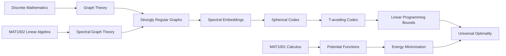

# Mathematics Roadmap

This repository is a public, anonymized learning roadmap. It tracks how course mathematics grows into research-facing mathematics, with a special focus on the bridge:



## Current semester

- `MAT1001`: calculus, analysis habits, Taylor approximation, one-variable optimization.
- `MAT1002`: linear algebra, inner products, eigenvalues, eigenspaces, Gram matrices.
- Discrete mathematics background: graph theory, paths, connectivity, proof style.
- Programming support: computational experiments, matrices, graph spectra, visualization.

## Repository purpose

This is not only a study log. It is a trace of how mathematical interests become research directions.

The repository has two layers:

1. **Knowledge Map** — mathematical dependencies and conceptual structure.
2. **Footprint Trace** — when and why a concept became personally meaningful.

## Privacy rule

This public version intentionally avoids real names, private emails, private institutions, mentor identities, and personal identifiers. Research-facing content is described by topic, not by person.

Use labels such as:

- `target research area`
- `research mentor`
- `recent reading`
- `spherical codes project`
- `spectral graph theory bridge`

Do not use real names, emails, screenshots, private messages, or identifiable personal stories.

## Quick navigation

- [Roadmap](roadmap.md)
- [Footprint Trace](trace.md)
- [Glossary](notes/glossary.md)
- [Questions](notes/questions.md)
- [Reading Log](notes/reading-log.md)
- [Mini-project: SRG spectral embeddings](projects/srg-spectral-embeddings.md)

## Weekly workflow

1. Add short notes under `progress/`.
2. Add new questions to `notes/questions.md` or as GitHub Issues.
3. When a concept becomes meaningful, create a new file in `footprints/`.
4. If a topic becomes stable, summarize it under `topics/`.
5. Run the privacy checker before publishing:

```bash
python scripts/privacy_check.py
```

## Minimal update ritual

```text
Learned → Understood well → Still unclear → Connection to research bridge → Next action
```

Keep the system alive, not perfect.
