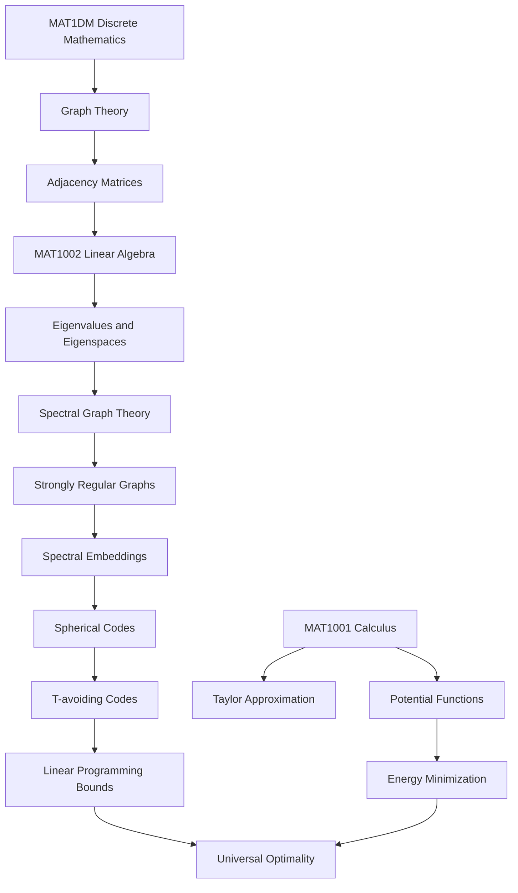

# Knowledge Map

This page records the mathematical dependency map from current courses to research-facing topics.

## Main route

## Stage 1 — Calculus and analysis foundation

**Course anchor:** `MAT1001`

Core questions:

- How do functions behave locally?
- How do derivatives describe change?
- How do integrals describe accumulated quantities?
- How can Taylor polynomials approximate functions?
- How can one-variable optimization prepare intuition for energy problems?

Research-facing connections:

- potential functions
- energy minimization
- interpolation
- approximation
- proof habits in analysis

## Stage 2 — Linear algebra as research infrastructure

**Course anchor:** `MAT1002`

Core questions:

- How can geometry be encoded by vectors and inner products?
- How can structure be encoded by matrices?
- What information is stored in eigenvalues and eigenspaces?
- How can a graph become a configuration of points on a sphere?

Essential skills:

- compute eigenvalues and eigenvectors
- understand orthogonal projections
- work with symmetric matrices
- use Gram matrices to describe point configurations
- interpret positive semidefinite matrices geometrically

## Stage 3 — Graph theory to spectral graph theory

Prerequisites:

- discrete mathematics
- linear algebra

Core topics:

- graphs and adjacency matrices
- regular graphs
- graph complements
- eigenvalues of adjacency matrices
- strongly regular graphs
- spectral graph embeddings

Core questions:

- What makes a graph strongly regular?
- Why does a strongly regular graph have only three adjacency eigenvalues?
- How do eigenspaces turn graph vertices into points on a sphere?
- Why do adjacent and non-adjacent vertex pairs produce only two inner product values after embedding?

## Stage 4 — Spherical codes and designs

Core definitions:

- A **spherical code** is a finite set of points on a unit sphere.
- An **inner product set** records all inner products between distinct points in a code.
- A **T-avoiding code** is a spherical code whose inner products avoid a specified forbidden set `T`.
- A **spherical design** is a point configuration that averages low-degree polynomials like the whole sphere.

Core questions:

- How does inner product describe distance on a sphere?
- What does it mean to forbid a distance or angle interval?
- Why are highly symmetric configurations often optimal?

## Stage 5 — Polynomial certificates and LP bounds

Core topics:

- linear programming bounds
- polynomial certificates
- Gegenbauer polynomials
- positive definiteness
- energy lower bounds
- cardinality upper bounds

Proof skeleton:

1. Construct a polynomial with the correct sign on allowed inner products.
2. Expand it in the orthogonal polynomial basis appropriate for the sphere.
3. Check coefficient signs.
4. Use positivity of moments to obtain a bound.
5. Show a known configuration attains the bound.

## Stage 6 — Energy minimization and universal optimality

Core topics:

- potential functions
- pairwise energy
- absolutely monotone potentials
- universal optimality

Core question:

> How can one point configuration be optimal for an entire class of energy functions?

## Spring readiness checklist

- [ ] Explain what a spherical code is.
- [ ] Explain what a T-avoiding spherical code is.
- [ ] Explain why inner products describe distances on a sphere.
- [ ] Explain how a graph adjacency matrix leads to eigenvalues and eigenspaces.
- [ ] Explain how strongly regular graphs produce spherical codes through spectral embeddings.
- [ ] Explain the basic idea of a linear programming bound.
- [ ] Explain universal optimality in plain mathematical language.
- [ ] Compute eigenvalues of small graph adjacency matrices.
- [ ] Construct spectral embeddings for small graphs.
- [ ] Compute inner product distributions of embedded points.
- [ ] Test whether a code is T-avoiding for a given forbidden interval.
- [ ] Compute sample pairwise energies for simple potentials.
