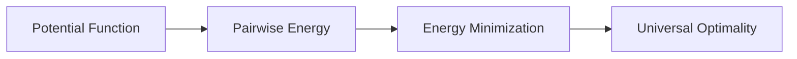

# Energy Minimization

## Pairwise energy

Given a potential function `h`, the energy of a spherical code is the sum of `h(x · y)` over all distinct pairs of points.

## Intuition

A configuration is energy-minimizing if its points arrange themselves in a globally efficient way according to the chosen interaction.

## Universal optimality

A configuration is universally optimal if it minimizes energy for an entire class of potential functions, not just one.

## Research bridge

## Questions

- What classes of potentials are natural on the sphere?
- Why are highly symmetric configurations often energy-minimizing?
- How can one proof cover many different potential functions?
