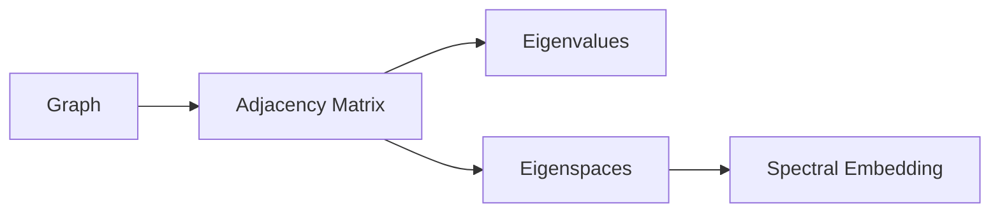

# Graph Theory

## Why it matters

Graph theory gives a language for structure, paths, constraints, and connectivity.

## Core vocabulary

- vertex
- edge
- degree
- path
- cycle
- connected graph
- regular graph
- complement graph
- adjacency matrix

## Bridge to linear algebra

A graph becomes a matrix through its adjacency matrix. Once the graph becomes a matrix, eigenvalues and eigenspaces can reveal hidden structure.

## Questions

- How much graph structure is visible from the spectrum?
- When do graph vertices naturally become points on a sphere?
- How do regularity and symmetry make optimization possible?
