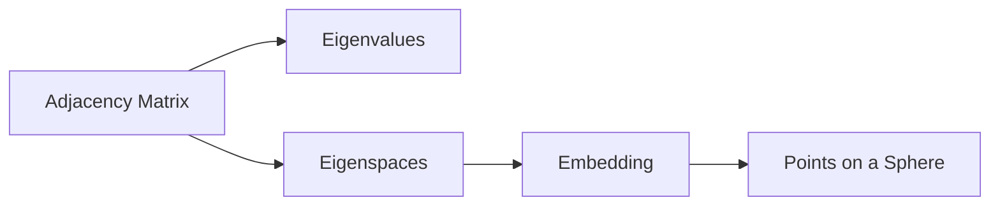

# Spectral Graph Theory

## Core idea

Spectral graph theory studies graphs through eigenvalues and eigenspaces of matrices associated with the graph.

## Main matrices

- adjacency matrix
- Laplacian matrix
- normalized Laplacian

For the current roadmap, the adjacency matrix is the main object.

## Key bridge

## Why it matters for the research bridge

Some highly regular graphs have eigenspaces that create spherical point configurations. These configurations can then be studied as spherical codes.

## Practice problems

- Compute the spectrum of a cycle graph.
- Compute the spectrum of a complete graph.
- Compare the spectrum of a graph and its complement.
- Find a low-dimensional eigenspace and use it for a vertex embedding.
