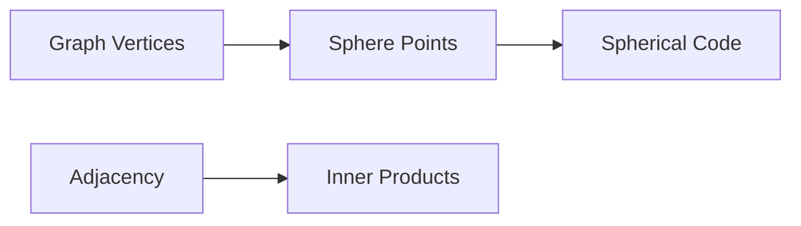

# Spherical Codes

## Definition

A spherical code is a finite set of points on a unit sphere.

## Inner product viewpoint

For unit vectors `x` and `y`, the inner product `x · y` records the angle between them. Therefore, pairwise inner products encode the geometry of a spherical code.

## Key objects

- code `C`
- cardinality `|C|`
- inner product set `I(C)`
- maximal cosine `s(C)`
- distance distribution

## Why they matter

Spherical codes turn geometry into finite combinatorial data. This makes it possible to use linear algebra, polynomial methods, and optimization arguments.

## Bridge from graph theory

Some graph embeddings produce spherical codes. In this route, graph vertices become points on a sphere, and adjacency information becomes inner product information.

