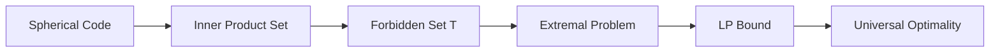

# T-avoiding Spherical Codes

## Definition

A spherical code is `T-avoiding` if no inner product between distinct points falls inside a forbidden set `T`.

In symbols:

```text
I(C) ∩ T = empty
```

## Intuition

A usual spherical code may forbid points from getting too close. A T-avoiding code can forbid more specific angle or distance intervals.

## Why this is interesting

Forbidden intervals create a more refined optimization problem:

- What is the largest possible code?
- What is the smallest possible design?
- Which configurations minimize energy?
- Can one configuration be optimal for many potentials?

## Research bridge



## Questions

- How does changing `T` change the extremal problem?
- Which known configurations remain optimal under T-avoiding restrictions?
- What polynomial certificates prove optimality?
