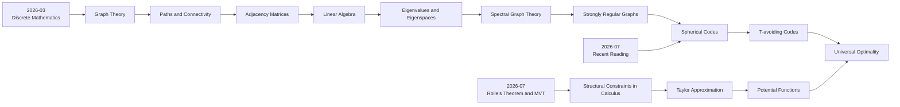

# Footprint Trace

This page records when each mathematical branch became meaningful, not only when it was studied.



## Timeline

| Time | Footprint | Trigger | Branch opened |
|---|---|---|---|
| 2026-03 | Discrete Mathematics → Graph Theory | Graph theory made structure visible | paths, connectivity, graph constraints |
| 2026-05 | Graph Theory → Research Direction | Graph-theory reading and mentor conversations | research-facing graph theory |
| 2026-07 | Rolle's Theorem → MVT Chain | A theorem felt like a hidden structural constraint | calculus as structure, not just computation |
| 2026-07 | T-avoiding Spherical Codes | Recent reading on forbidden inner products | spherical codes, energy minimization |
| 2026-S2 | MAT1002 Linear Algebra | Eigenvalues as structure detectors | spectral graph theory, embeddings |
| 2026-S2 | MAT1001 Calculus | Approximation and optimization tools | potential functions, LP certificates |

## How to add a footprint

Create a file under `footprints/` using the template:

```text
footprints/YYYY-MM-short-topic.md
```

Every footprint should answer:

- What happened?
- What concept became meaningful?
- Why did it matter?
- Which future branches did it open?
- What is still unclear?
